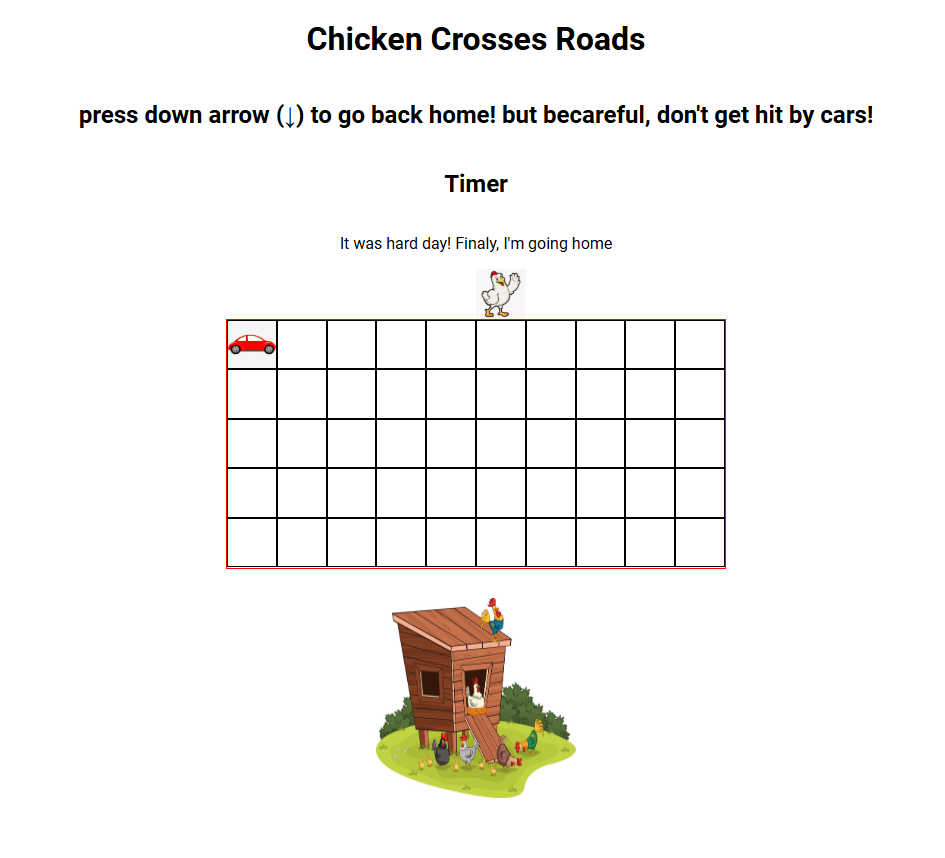

# Unit-1-browser-based-game-project
✅ More than two items marked incomplete in this section will require you to use your one redo to re-submit them. If two or fewer items are marked incomplete, the project is considered passing. Your README must contain the items or sections below.

Screenshot/Logo: A screenshot of your app or a logo.
Your game’s name: Include a description of your game and what it does. Background info about the game and why you chose it is a nice touch.
Getting started: Include a link to your deployed game and any instructions you deem important. This should also contain a link to your planning materials.
Attributions: This section should include links to any external resources (such as libraries or assets) you used to develop your application that require attribution. You can exclude this section if it does not apply to your application.
Technologies used: List of the technologies used, for example: JavaScript, HTML, CSS, etc.
Next steps: Planned future enhancements (stretch goals).

