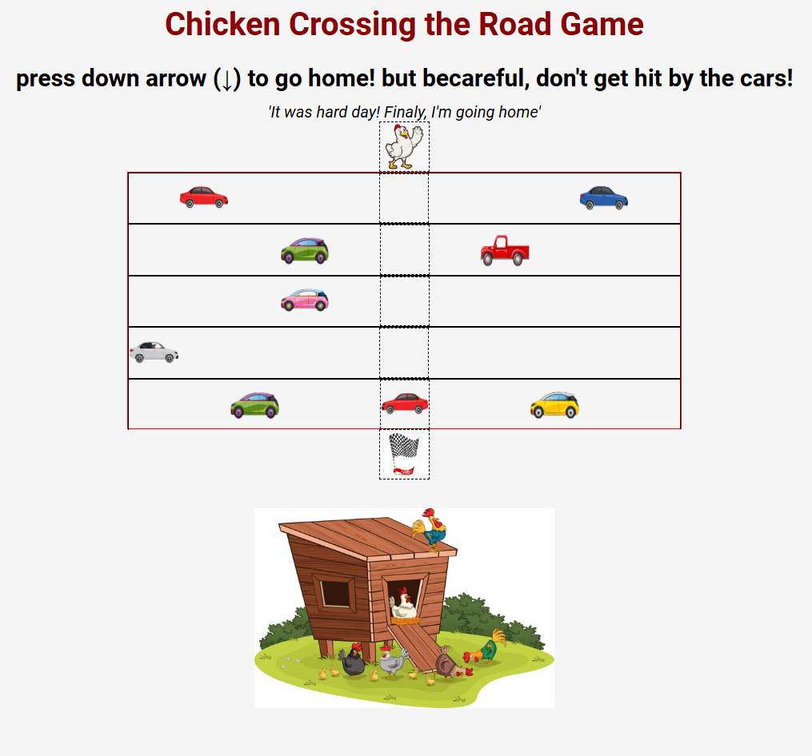
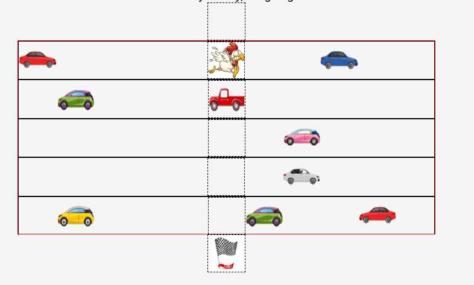
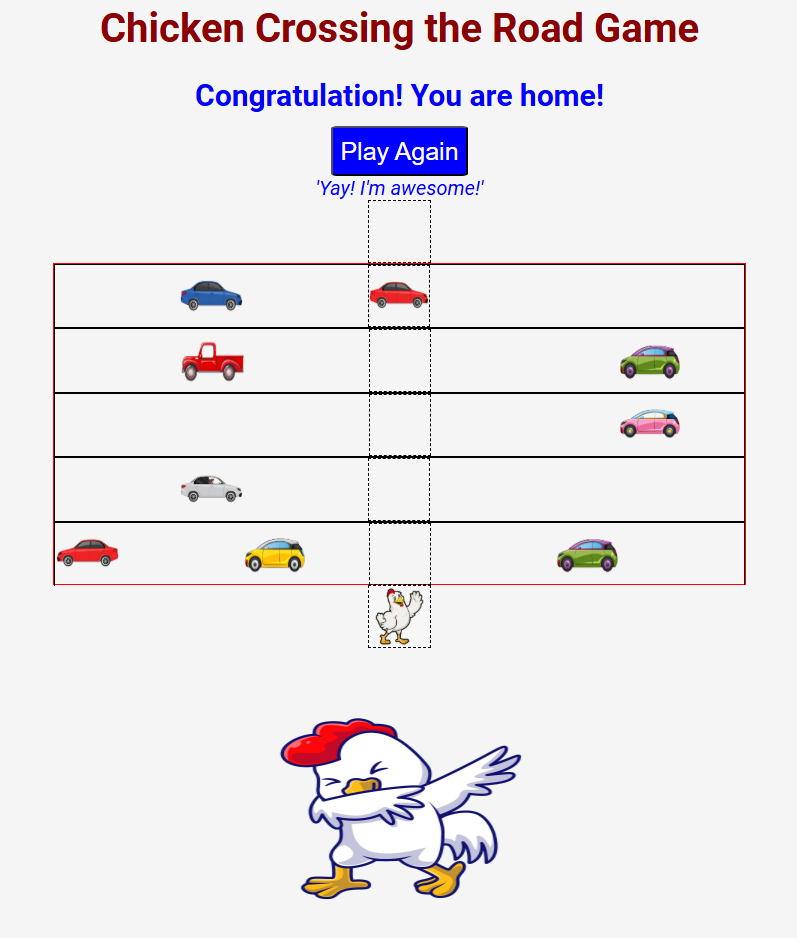
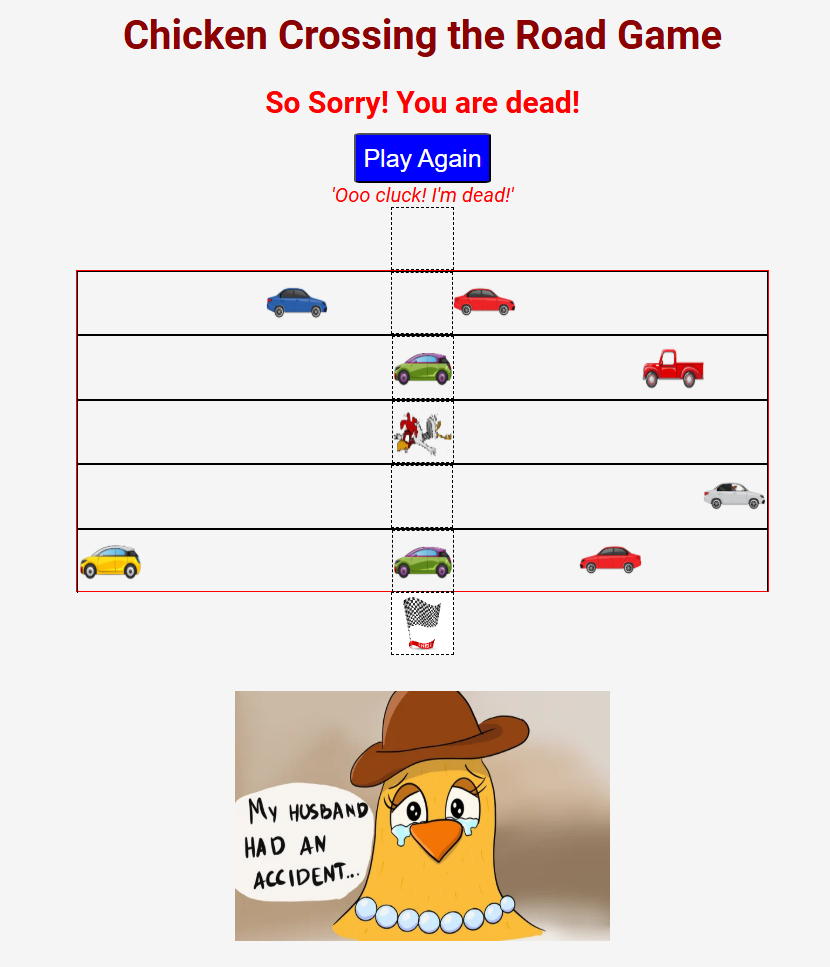

# Chicken Crossing the Road Game
## Unit 1 - Browser based game project
### By Yunus Herman

"Why did the chicken cross the road?" is a common riddle joke with the answer being "To get to the other side." because of that, this game was made. And also I have chickens in my backyard and I love them very much!

### Name and Link
The name: Chicken Crossing the Road Game
The link: https://yunus-h.github.io/chicken-crossing-the-road-game/

After a long day of working as a software engineer, this chicken is happy to finally go home. But wait! He lives across the street and there are lots of cars! Let's help this chicken cross the road! If the chicken gets home safely, it's a win, but if it gets hit by a car, it's a loss! 

Simply press the down arrow button, and the chicken will run downwards towards its house. Once you've taken a step, there's no going back! Be careful not to get hit by a car!   

Win: If this chicken reaches home, the picture below turns into a cool chicken! The text above also changes to 'congratulation!'. The 'Play Again' button also appears and can be clicked if you want to play again.

Lose: If you crash into a car or get hit by a car! The poor chicken's wife is very sad because her husband died on the road. The text above changes to 'So sorry! You are dead!' and the 'Play Again' button can also be clicked.

The game consists of 5 streets, some to the right and some to the left. These streets are actually arrays of flex-boxes. I used the addEventListener() method to make the chicken move one step down when the down arrow button is pressed. And I also used the SetInterval() method to make the cars move at different speeds. The DOM is also used to replace text, images, styles and others.

I downloaded images of cars, chickens, and so on from free sites and also a lot of sources of information about HTML, CSS, and Javascript.

### Attributions:
https://fonts.google.com \
https://stackoverflow.com/questions/11702319/how-to-move-an-image-with-javascript \
https://www.w3schools.com/jsreF/met_win_setinterval.asp \
https://www.freepik.com/free-vector/ 

### Technologies used:
HTML
CSS
Javascript

### Next steps:
This game can be made into more difficult and more challenging levels such as more roads, cars, faster cars, longer chicken paths and also chicken movements that can go up and left and right and also a timer feature, score system. The appearance can also be made more attractive with better pictures and sound effects and music.
